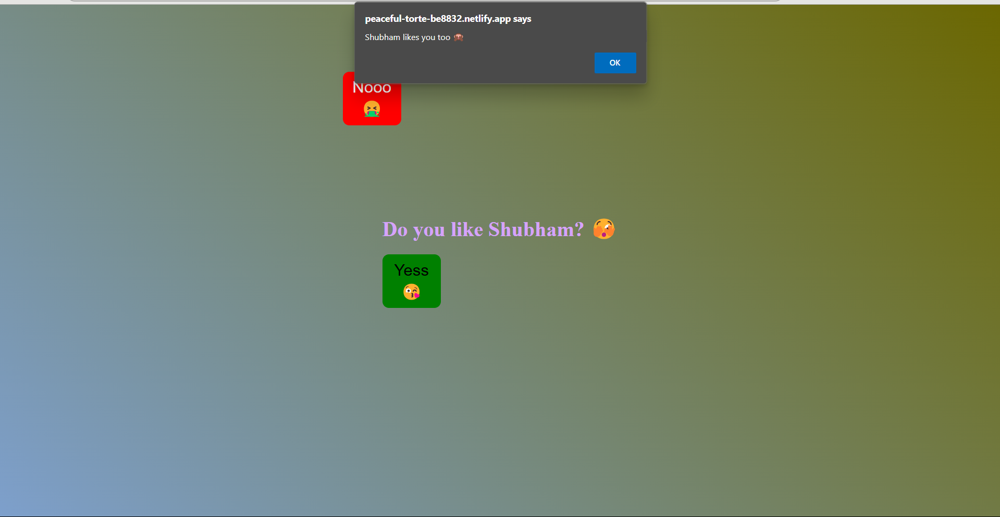

# She Said Yes - Fun App

A fun interactive app to propose with a playful twist, built using HTML, CSS, and JavaScript.

[Live Demo](https://peaceful-torte-be8832.netlify.app/)

---

## Overview
This project is a humorous and engaging app where:
- Users can propose by clicking a "Yes" button.
- The "No" button moves away on mouse hover, preventing rejection.
- Provides an entertaining experience with dynamic button behavior.

---

## Features
- **Interactive Buttons:** "Yes" and "No" buttons with unique behaviors.
- **Dynamic Movement:** The "No" button shifts position dynamically on hover.
- **Confirmation Alert:** Displays a congratulatory alert when "Yes" is clicked.
- **Responsive Design:** Works seamlessly on desktops, tablets, and mobile devices.

---

## Screenshots




---

## Technologies Used

### Frontend
- **HTML5:** Structured content.
- **CSS3:** Styling and animations.
- **JavaScript:** Adds interactivity and dynamic behavior.

### Hosting
- Hosted on Netlify: [Live Demo](https://peaceful-torte-be8832.netlify.app/)

---

## Installation

### Steps
1. Clone the repository:
   ```bash
   git clone https://github.com/your-username/she-said-yes.git
   ```

2. Navigate to the project directory:
   ```bash
   cd she-said-yes
   ```

3. Open the `index.html` file in your browser:
   ```bash
   open index.html
   ```

---

## How It Works
1. **Propose with Buttons:** Click the "Yes" button to confirm.
2. **Dynamic No Button:** Try to click the "No" button, and it moves away, making rejection impossible.
3. **Alert Message:** Shows a congratulatory message when "Yes" is clicked.

---

## Future Improvements
- Add animations for the "Yes" button when clicked.
- Customize button styles and sounds for added fun.
- Include more scenarios or dialogs for entertainment.

---

## Contribution
Contributions are welcome! Feel free to fork the repository and submit a pull request.

---

## Contact
For queries or feedback, please contact [Shubham](mailto:shubhamjaishu@gmail.com).
